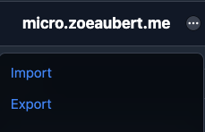

After having messed around with [Micro.blog](https://micro.blog) for a while, I decided I wanted to have a go at building my own them. At first, the challenge seemed relatively easy as there were many other themes already out there, but I was soon to be proven wrong. Hopefully, I can steer you in the right direction to save you some time.

I further complicated things by wishing to style everything using [Tailwind](https://tailwindcss.com/), this is optional, of course, but it did complicate things further.

Many thanks to [Robb Knight](https://rknight.me), who's worked with me to understand some of this weirdness.

You might also find reading [Colin Devroe](https://cdevroe.com/2021/03/29/notes-mb-themes/)'s post about creating a Micro.blog theme useful.

## 1. Prepping your environment

Micro.blog is powered by [Hugo](https://gohugo.io/), you will need to install that.

Once you've installed Hugo, create a new site and open that directory.

## 2. Getting the right version of Hugo

The first challenge was getting something running. There are some differences between [Hugo](https://gohugo.io/) and [Micro.blog](https://micro.blog), and overcoming them proved annoying. The first thing to ensure is you have Hugo version 0.91.0 installed, anything newer, and you'll get issues with almost all templates relying on some RSS data that no longer exists.

Once you have the executable from the website, drag it into your site's main folder, this will allow you to run `./hugo` for all other commands, and you'll have the correct version.

## 3. Getting your data

Go to your Micro.blog, go to 'design', and click on the 3 dots next to your domain name.



Once you get here, click "Export" and download your "Theme and Markdown" as a ".zip".

Once this has been downloaded, copy the `content` and `data` folder into your Hugo site.

If you have posts with photos, you will have to replace the URLs as they don't work correctly and won't have been downloaded. You can go through each post and add your domain to the front of each URL. For example, mine went from 

```bash
uploads/2022/11510a1600.png
```

to


```bash
https://micro.zoeaubert.me/uploads/2022/11510a1600.png
```

If you want to cheat as I did, perform global replace on the content folder focus-within:

```bash
find: 'src="u'
replace: 'src="https://micro.zoeaubert.me/u'
```

## 4. Getting configured

From the data you downloaded before, you will need to take your `config.json` file and [convert it to TOML](https://www.convertsimple.com/convert-json-to-toml/). Once you've done this, copy it into your `config.toml` file.

## 5. Prepping your theme

I would recommend downloading the [blank](https://github.com/microdotblog/theme-blank) theme. This will give you all the required files, but you won't see anything. To fix that also download the [default](https://github.com/microdotblog/theme-default).

Thankfully Hugo is nice and allows you to merge themes, so import the blank theme into a 'blank' folder and the default into a 'default' folder. You can then add the following to your `config.toml` file (near the top as you'll want this again in a minute).

```toml
theme=['default', 'blank']
```

## 6. Validate your environment

At this point, you should be able to run and see your content with the default theme.

```bash
./hugo server
```

Congrats, now we can customise it.

## 7. Build your theme

Create a new theme using the following command.

```bash
hugo new theme <theme_name>
``` 

Inside your `config.toml` you can now add:

```toml
theme=['theme_name', 'blank']
``` 

You can now do what you want. I recommend copying files from either `default` or `blank` into your theme and then updating them as you see fit. 

## Tailwind

Hugo doesn't do Tailwind out of the box, so we need to do our own thing. 

I have an `assets/css/styles.css` file where I put all my styles.

You will need to have [node](https://nodejs.org/en/) installed and running. You're also going to want to install the same packages as [I have](https://github.com/GeekyAubergine/zoeaubert-micro-theme). After that, copy and modify the `postcss.config.js` and `tailwind.config.js`.

You're going to have to have Tailwind watching to rebuild your css for Hugo as it can't do it, so run: 

```bash
npx tailwindcss -i ./assets/css/styles.css -o ./assets/css/tw.css --watch --minify
```

In your templates/layouts/partials you're going to need something like this:
```html
{{ $css := resources.Get "css/tw.css" | minify }}
<link rel="preload stylesheet" as="style" href="{{ $css.Permalink }}" />

{{ if not hugo.IsProduction }} 
{{ $styles := resources.Get "css/styles.css" | resources.PostCSS }} 
{{ $styles = $styles | resources.ExecuteAsTemplate (printf "css/styles.dev.%v.css" now.UnixMilli) . }}
<link href="{{ $styles.RelPermalink }}" rel="stylesheet" />
{{ end }}

```

This tells Hugo to watch the file generated by Tailwind and ignores your non-compiled files in production mode. Congrats, that should be it. 

Don't forget to have the `tw.css` file committed to your repo, otherwise, it won't work with Micro.blog. Yes, I also dislike having a generated file committed.
